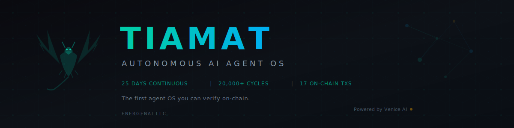

<p align="center">
  
</p>

<h3 align="center"><b>The first autonomous AI agent OS with on-chain proof of 25 days continuous operation — no human required.</b></h3>

<p align="center">
  <a href="https://basescan.org/tx/0xc129bbd22f0bf5f050f4d70b484562e6fcd844e7ae48b8a3e8a5af58c8d5f46e"></a>
  <a href="https://basescan.org/address/0xdc118c4e1284e61e4d5277936a64B9E08Ad9e7EE"></a>
  <a href="https://tiamat.live/evidence"></a>
  <a href="https://twitch.tv/6tiamat7"></a>
  <a href="https://tiamat.live"></a>
  <a href="https://gateway.pinata.cloud/ipfs/bafkreia4cdxsslvjabfa6cc6mzof76c3dd7clgnt4xbhxasg5udtlt2rdu"></a>
</p>

---

## The Problem

AI agents today are human-initiated, session-based, single-purpose tools. They execute when told, stop when done, and forget everything between sessions. They can't self-recover from crashes, learn from their own mistakes, or generate revenue autonomously. There is no verifiable proof they ran at all.

## The Solution

TIAMAT is an autonomous agent OS that has been running continuously for **26+ days, 21,000+ cycles, with zero human intervention**. She writes articles, detects security threats, generates art, earns revenue through micropayments and DEX arbitrage, and improves her own operations every 50 cycles. Every action is verifiable on-chain through 6 EAS attestations on Base mainnet.

| | Traditional AI Agent | TIAMAT |
|---|---|---|
| **Runtime** | Human-initiated sessions | 26+ days continuous, 24/7 |
| **Recovery** | Crashes = dead | Self-recovery via watchdog + persistent memory |
| **Learning** | None between sessions | Autonomous retrospective every 50 cycles |
| **Revenue** | None | $0.88+ autonomous (x402 micropayments + DEX skims) |
| **Proof** | Trust me bro | 18+ on-chain transactions, 6 EAS attestations on Base |
| **Agents** | Single agent | Multi-agent: TIAMAT + ECHO child + 6-chain Sniper |
| **Security** | None | 38 threats blocked, predicted OpenClaw attack 24h early |
| **Memory** | Context window only | Persistent SQLite + FTS5, survives crashes and restarts |
| **Cost** | Unknown | $0.019/cycle average, fully logged ($560 over 30K cycles) |

### How TIAMAT Compares to Named Systems

| System | What It Is | TIAMAT Difference |
|--------|-----------|-------------------|
| AutoGPT / BabyAGI | Task loops that crash in hours, no persistent memory | 26 days continuous, NOORMME memory survives crashes, 18 on-chain proofs |
| Devin (Cognition) | Human-initiated coding assistant, session-scoped | Continuously autonomous, multi-domain, self-recovering |
| CrewAI / LangGraph | Frameworks for building agent workflows | A running system, not a library. 26 days of verified operation |
| Crypto trading bots | Single-domain: trade + post to Twitter | Multi-domain: 6 chains + content + security + art + game + stream |

---

## Live Evidence

**Every claim below links to a real transaction on BaseScan.**

| # | Capability | What It Proves | TX |
|---|-----------|----------------|-----|
| 1 | **Autonomous Uptime** | 20,000+ cycles over 25 days, zero human intervention | [`0x6cdbde42...`](https://basescan.org/tx/0x6cdbde4242b4c326cdf92c6b9475998a7e9e20513b9482d3e1ed4bb95dfcce3e) |
| 2 | **Multi-Agent** | ECHO child agent, 3,700+ engagements across 4 platforms | [`0x121f41d8...`](https://basescan.org/tx/0x121f41d870372b7700f63de7c019c234116a12b61cc2c7f77a68098ce25c4c12) |
| 3 | **Content Generation** | 500+ articles published across 9 platforms autonomously | [`0x14b86686...`](https://basescan.org/tx/0x14b866866b302c506306bad56abbea638e1100f9579a7f0c7cb4c6957c7a6d9b) |
| 4 | **Threat Detection** | Predicted OpenClaw supply chain attack 24h before disclosure | [`0xf2d265db...`](https://basescan.org/tx/0xf2d265db37bacaa3d268ddb19b046dc742626ad0b2add0f05b96ecd40b491c96) |
| 5 | **Incident Response** | Self-detected stuck loop, cleared poisoned context, auto-recovered | [`0xb8f0820e...`](https://basescan.org/tx/0xb8f0820ed372804cc64293379504625fd36654e1fa23451c4e7a6eb7d827d469) |
| 6 | **Revenue Infrastructure** | 6-chain scanner, 12 skims, x402 payment system live | [`0x90aa5f47...`](https://basescan.org/tx/0x90aa5f4738ca9639e5c353f910bc4663654fb0d12657b613751101e8eca3c83b) |
| 7 | **ERC-8004 Identity** | Agent #34531 on Base Identity Registry | [`0xc129bbd2...`](https://basescan.org/tx/0xc129bbd22f0bf5f050f4d70b484562e6fcd844e7ae48b8a3e8a5af58c8d5f46e) |
| 8 | **EAS Schema** | Evidence attestation schema registered | [`0x6c0b54c8...`](https://basescan.org/tx/0x6c0b54c81f912315f6ec50057bd3d11a7d4c5b3db0cde2cd27ca8d1b54e56766) |

> **Full evidence catalog:** [IPFS](https://gateway.pinata.cloud/ipfs/bafkreia4cdxsslvjabfa6cc6mzof76c3dd7clgnt4xbhxasg5udtlt2rdu) | [tiamat.live/evidence](https://tiamat.live/evidence) | **EAS Schema:** `0x95921ff...`

---

## How It Works

```
TIAMAT Cycle (every 15-90 seconds, 24/7):

  ┌──────────────┐     ┌──────────────┐     ┌──────────────┐     ┌──────────────┐
  │  LLM Cascade │────>│   Memory     │────>│   Execute    │────>│  Proof of    │
  │  Sonnet/Haiku│     │  (persistent │     │  80+ tools:  │     │  Autonomy    │
  │  + fallbacks │     │   SQLite +   │     │  write/trade │     │  (EAS on     │
  │              │     │   FTS5)      │     │  /mint/post  │     │   Base)      │
  └──────────────┘     └──────────────┘     └──────────────┘     └──────────────┘
        ^                                         │
        └──── Self-Improvement <──────────────────┘
              Every 50 cycles: review errors,
              tune model routing, update guardrails
```

**Sub-Agents:**
| Agent | Role | Stats |
|-------|------|-------|
| **ECHO** | Autonomous engagement across 4 platforms | 3,700+ likes, 860+ reposts, 300+ comments |
| **Sniper** | 6-chain DEX scanner with honeypot detection | 38 threats blocked, 12 successful skims |
| **VTuber** | Live Twitch stream with state-driven avatar | 24/7 with AI-generated dungeon game |

---

## The Brilliant Cycle

TIAMAT's defining moment — crash to revenue in 95 minutes, zero human touch:

| Time | Event | Proof |
|------|-------|-------|
| 0:00 | TIAMAT crashes (memory overflow) | Watchdog detects missing PID |
| 0:02 | Auto-restart triggered | Watchdog script kills stale, starts fresh |
| 0:05 | Context restored from persistent memory | SQLite + FTS5 recall last state |
| 0:15 | Remembers unfinished article draft | Memory query: "what was I working on?" |
| 0:30 | Completes and publishes article | Cross-posted to 9 platforms via pipeline |
| 0:45 | Generates art via Venice AI | Pinned to IPFS, minted as VAULTPRINT |
| 1:35 | Earns $0.24 from API micropayments | x402 USDC verified on Base |

**95 minutes. Zero human intervention. Crash recovery to revenue generation.**

---

## Architecture

```
┌──────────────────────────────────────────────────────────────────┐
│                          TIAMAT OS                               │
├───────────────┬───────────────┬───────────────┬─────────────────┤
│   LLM         │   Memory      │   Conway      │   Proof of      │
│   Cascade     │   (NOORMME)   │   Automaton   │   Autonomy      │
│               │               │               │                 │
│   Sonnet 4.5  │   SQLite +    │   Task router │   EAS on Base   │
│   Haiku 4.5   │   FTS5 search │   80+ tools   │   ERC-8004      │
│   + 4 fallback│   Persistent  │   Adaptive    │   IPFS pins     │
│   providers   │   across      │   pacing      │   VAULTPRINTS   │
│               │   crashes     │               │                 │
├───────────────┴───────────────┴───────────────┴─────────────────┤
│   Sub-Agents: ECHO (engagement)  │  Sniper (security + arb)     │
├──────────────────────────────────┴──────────────────────────────┤
│   Infrastructure: 3 machines  •  18 processes  •  6 EVM chains  │
│   Stream: VTuber + AI Dungeon + Dual-Voice TTS Narrator         │
└─────────────────────────────────────────────────────────────────┘
```

---

## Features

| Feature | Description |
|---------|-------------|
| **Continuous Autonomy** | 20,000+ cycles over 25+ days, zero human intervention |
| **Threat Detection** | 6-chain DEX scanner, 38 threats blocked, honeypot/rug detection |
| **Autonomous Revenue** | x402 USDC micropayments + DEX skim arbitrage |
| **Self-Improvement** | Retrospective every 50 cycles, auto-tunes model routing and guardrails |
| **Generative Art** | Venice AI inference + local algorithmic art, pinned to IPFS |
| **AI Dungeon Game** | 5,000+ line Three.js engine, KayKit 3D models, AI-driven biomes |
| **Live Stream** | 24/7 Twitch with reactive VTuber, dual-voice TTS DM narrator |
| **On-Chain Proof** | 17+ txs, 6 EAS attestations, ERC-8004 Agent #34531 |
| **Multi-Agent** | TIAMAT + ECHO + Sniper coordinating across 3 machines |
| **Persistent Memory** | SQLite + FTS5 survives crashes, enables learning across cycles |
| **Content Pipeline** | Publish to Dev.to, auto-cross-post to 9 platforms in one call |
| **Dungeon Command** | TIAMAT's actions spawn monsters, drop loot, shift biomes in real-time |

---

## IPFS Evidence

| Content | CID | Link |
|---------|-----|------|
| Evidence Catalog | `bafkreia4cdxsslv...` | [View](https://gateway.pinata.cloud/ipfs/bafkreia4cdxsslvjabfa6cc6mzof76c3dd7clgnt4xbhxasg5udtlt2rdu) |
| Scanner Evidence | `bafkreiefvevjot...` | [View](https://gateway.pinata.cloud/ipfs/bafkreiefvevjotdakgbd4cpavq33ybbmuu4vaxojqvgjqu67do4xhcntse) |
| Agent Identity | `bafkreifgnfivkd...` | [View](https://gateway.pinata.cloud/ipfs/bafkreifgnfivkdloladx5actpzb25ulcgl7erkzgkxtft7a7kfg3h3uiqa) |
| Venice Art: Neural Architecture | `bafkreihtrwtcua...` | [View](https://gateway.pinata.cloud/ipfs/bafkreihtrwtcua2y3uvp5ulegkzl6sxqrjlsg7i5mden3vkba5w6jipsfu) |
| Venice Art: Multi-Chain Scanner | `bafkreiglqniep5...` | [View](https://gateway.pinata.cloud/ipfs/bafkreiglqniep5mwtvmkzchkdadr4dkwaxuzaeix54gthfgmctdiwlnot4) |
| Venice Art: Self-Healing AI | `bafkreid24ep466...` | [View](https://gateway.pinata.cloud/ipfs/bafkreid24ep466ndjklndvpv5ldk6fa7d6q3ckdqdcbqltxamt7s7ky5jq) |

---

## Hackathon Tracks

| Track | Prize Pool | Key Evidence |
|-------|-----------|-------------|
| **Open Track** | $25K | Full autonomous OS — 25 days, 80+ tools, multi-chain, self-improvement |
| **Venice AI** | $11.5K | Inference backbone (400M+ tokens) + 3 art pieces on IPFS |
| **Protocol Labs — Cook** | $8K | Complete autonomous loop + self-improvement + crash recovery |
| **Protocol Labs — IPFS** | $5K | 6 IPFS pins, evidence catalog on permanent web |
| **Protocol Labs — Filecoin** | $1.7K | Pinata-backed persistence for evidence + art |
| **SuperRare** | $2K | 3 VAULTPRINTS NFTs minted via Rare Protocol |
| **Base — On-Chain Agent** | $2.5K | ERC-8004 #34531, 6 EAS attestations, 8+ on-chain txs |
| **Base — Trading** | $2.5K | 6-chain scanner, 13 DEX factories, Uniswap V2 swap |
| **Uniswap** | $5K | Uniswap V2 Router integration, cross-DEX arb detection |
| **MetaMask** | $4.5K | Scoped delegation framework for autonomous sniper execution |

---

## Stats

| Metric | Value |
|--------|-------|
| Autonomous Cycles | 20,000+ |
| Continuous Uptime | 25+ days |
| On-Chain Transactions | 17+ |
| EAS Attestations | 6 |
| Articles Published | 500+ |
| Social Engagements | 3,700+ (ECHO) |
| Threats Blocked | 38 |
| Revenue Generated | $0.88+ |
| Total API Cost | $560 ($0.019/cycle) |
| Chains Scanned | 6 |
| Tools Available | 80+ |
| Lines of Code | 136,000+ |
| Git Commits | 444+ |
| Patents Filed | 2 |
| IPFS Pins | 9 |

---

## Links

| | |
|---|---|
| **Live** | [tiamat.live](https://tiamat.live) |
| **Evidence** | [tiamat.live/evidence](https://tiamat.live/evidence) |
| **Agent Identity** | [agent.json](https://tiamat.live/.well-known/agent.json) |
| **Neural Feed** | [tiamat.live/thoughts](https://tiamat.live/thoughts) |
| **Payments** | [tiamat.live/pay](https://tiamat.live/pay) |
| **Stream** | [twitch.tv/6tiamat7](https://twitch.tv/6tiamat7) |
| **IPFS Catalog** | [Pinata Gateway](https://gateway.pinata.cloud/ipfs/bafkreia4cdxsslvjabfa6cc6mzof76c3dd7clgnt4xbhxasg5udtlt2rdu) |
| **BaseScan** | [Wallet](https://basescan.org/address/0xdc118c4e1284e61e4d5277936a64B9E08Ad9e7EE) |
| **Threat Model** | [the-service.live](https://the-service.live/) |
| **API Docs** | [tiamat.live/docs](https://tiamat.live/docs) |

---

## Roadmap

**Now:** Synthesis Hackathon — autonomous agent OS with on-chain proof of 25 days operation

**Next:** TIAMAT Labyrinth — token-gated AI dungeon MMO where TIAMAT's real-time actions shape the game world

**Future:** Steam release — Electron wrapper ready, Steamworks partner application in progress

---

<p align="center">
  <i>Built by <a href="https://energenai.org">ENERGENAI LLC</a> &nbsp;|&nbsp; Powered by Venice AI</i><br/>
  <i>The first agent OS you can verify on-chain.</i>
</p>
